# ByNotice


This a notification razor component for blazor. It is written entirely in C# and CSS.

## Quick Start

1. Add css to the html.

```html
<link rel="stylesheet" href="/_content/ByNotice/bynotice.css" />
```

2. Add namespace declaration in "_Imports.razor".

```c#
@using ByNotice
```
2. Add component "Notice" in "MainLayout.razor" (or whatever you want to use).

``` html
<Notice />
```

3. notify a message

```c#
await Notice.Instance.NotifyAsync(new NoticeOption()
{
    Message = "here is the message",
    Title = "here is tite"
});
```

Oh, you should install it first. Nuget path is [here](https://www.nuget.org/packages/ByNotice/).

```powershell
Install-Package ByNotice
```

result:

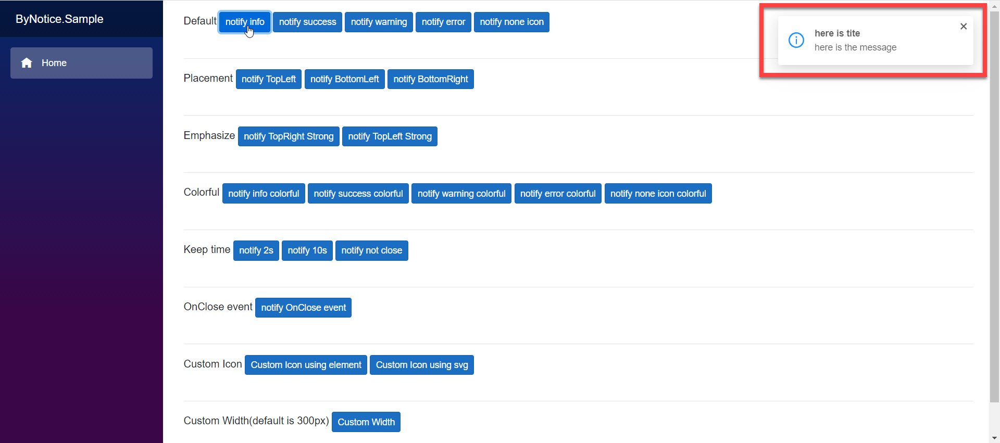

See wiki or "ByNotice.Sample" for more usage.

## Demo preview

**default style:**

default info

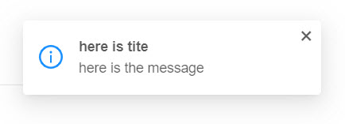

default success

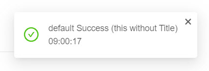

default warning


default error

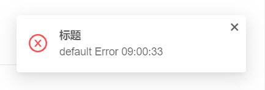

default none icon

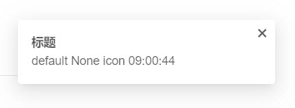

**colorful:**

colorful info

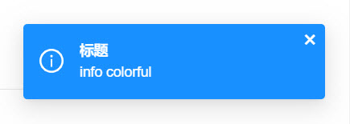

colorful success

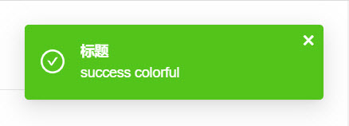

colorful warning

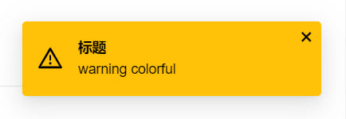

colorful error

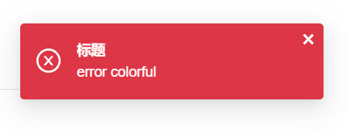


**custom width:**

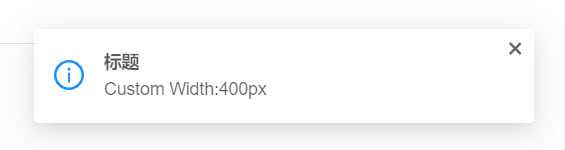

**custom icon:**

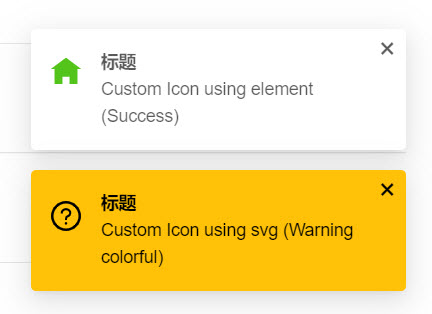

**emphasize**

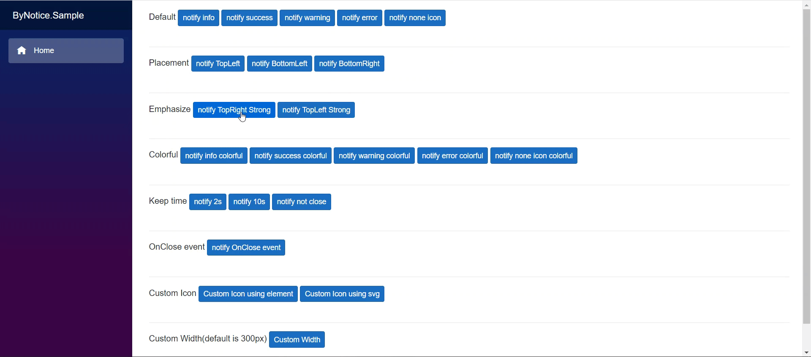


**OnClose Hook**

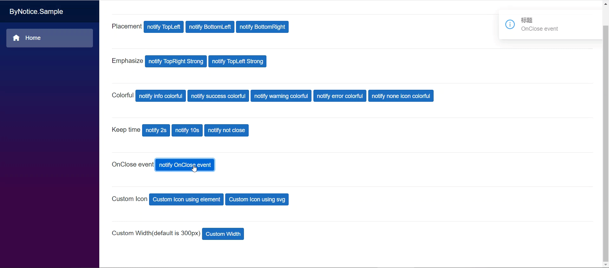

## Attention

Only one component instance is allowed in an application.

## Developer

zxyao

## License

MIT